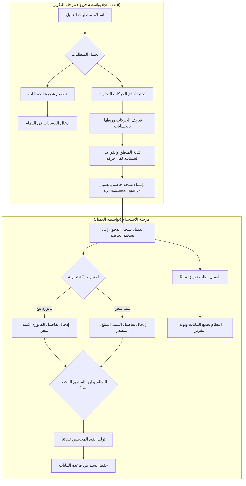
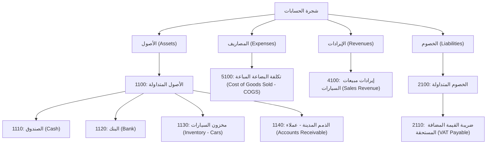

# وثيقة متطلبات المنتج (PRD) - نظام المحاسبة الديناميكي dynacc.ai

## 1. المقدمة

**dynacc.ai** هو نظام محاسبة سحابي مبتكر مصمم لتوفير حلول محاسبية مخصصة وديناميكية للشركات والمؤسسات بمختلف أحجامها. تكمن الفكرة الأساسية في التخلي عن الأنظمة المحاسبية التقليدية ذات القالب الواحد، وتقديم نظام يمكن "تكوينه" ليتناسب تمامًا مع العمليات التجارية والاحتياجات الفريدة لكل عميل. يتم ذلك عبر مرحلتين: مرحلة التكوين (Setup Phase) التي يقوم بها فريقنا، ومرحلة الاستخدام (Operational Phase) التي يستخدمها العميل في عملياته اليومية.

## 2. المشكلة

الشركات الصغيرة والمتوسطة والكبيرة على حد سواء تعاني من الأنظمة المحاسبية الجاهزة التي تفرض عليها طرق عمل لا تتناسب مع طبيعة نشاطها. هذا يجبر الشركات على:

- القيام بالكثير من العمل اليدوي خارج النظام.
- إنفاق مبالغ طائلة على تخصيص الأنظمة الجاهزة، وهو أمر معقد وغير فعال.
- صعوبة في توليد تقارير مالية دقيقة تعكس حقيقة أداء الشركة.

يهدف **dynacc.ai** لحل هذه المشكلة من خلال تقديم نظام مرن يمكن تشكيله بالكامل حسب متطلبات العميل.

## 3. الأهداف

- **المرونة الكاملة:** بناء نظام يسمح بتعريف هيكل الحسابات، أنواع الحركات التجارية، ومنطقها، والتقارير بشكل مخصص لكل عميل.
- **سهولة الاستخدام:** توفير واجهة مستخدم بسيطة وواضحة للعميل النهائي بعد مرحلة التكوين.
- **قابلية التوسع:** تصميم بنية تحتية قادرة على خدمة عدد كبير من العملاء بنسخهم المخصصة دون التأثير على الأداء.
- **الدقة والموثوقية:** ضمان دقة البيانات والقيود المحاسبية الناتجة عن الحركات التجارية.

## 4. شخصيات المستخدمين (User Personas)

### أ. فريق dynacc.ai (المُكوِّن للنظام)

- **الوصف:** محلل مالي أو محاسب تقني يمتلك فهمًا عميقًا للمحاسبة والقدرة على ترجمة متطلبات العميل إلى تكوين داخل النظام.
- **الاحتياجات:**
  - واجهة تكوين قوية لإنشاء وتعديل شجرة الحسابات.
  - أدوات مرنة لتعريف الحركات التجارية وتحديد أطرافها (الحسابات المدينة والدائنة).
  - محرر منطق (Logic Editor) لبرمجة القواعد الخاصة بكل حركة (مثل حساب الضرائب، الخصومات، الكميات).
  - القدرة على إدارة جميع نسخ العملاء من لوحة تحكم مركزية.

### ب. العميل (المستخدم النهائي)

- **الوصف:** محاسب، مدير مالي، أو صاحب عمل يستخدم النسخة المخصصة من النظام لإدارة الشؤون المالية لشركته.
- **الاحتياجات:**
  - لوحة معلومات (Dashboard) تعرض ملخصًا ماليًا سريعًا.
  - سهولة في إدخال الحركات التجارية اليومية (فواتير بيع، شراء، سندات قبض وصرف).
  - الوصول إلى تقارير مالية محددة مسبقًا (مثل الميزانية، قائمة الدخل، كشف حساب).
  - نظام صلاحيات واضح لإدارة وصول المستخدمين داخل شركته.

## 5. الميزات (Features)

### 5.1. مرحلة التكوين (لصالح فريق dynacc.ai)

- **إدارة الحسابات (Chart of Accounts):**
  - إنشاء شجرة حسابات ديناميكية (أصول، خصوم، إيرادات، مصاريف، ...إلخ).
  - تحديد خصائص كل حساب (اسم، كود، طبيعة الحساب - مدين/دائن، حساب رئيسي/فرعي).
- **إدارة الحركات التجارية (Transaction Types):**
  - إنشاء أنواع جديدة من الحركات (مثل: "فاتورة بيع سيارات"، "إيجار شهري"، "استلام دفعة من عميل").
  - تحديد الحسابات الافتراضية لكل حركة (الحساب المدين والحساب الدائن).
- **محرر المنطق (Logic & Rules Engine):**
  - ربط منطق مخصص بكل حركة تجارية.
  - القدرة على تنفيذ عمليات حسابية (ضرب، جمع، نسبة مئوية) بناءً على مدخلات الحركة.
  - مثال: في حركة "بيع 3 سيارات"، يقوم المنطق بضرب الكمية (3) في سعر السيارة، إضافة ضريبة القيمة المضافة، وتطبيق أي خصومات لإنشاء القيد المحاسبي الصحيح.
- **إدارة العملاء والنسخ:**
  - لوحة تحكم لإدارة جميع نسخ العملاء.
  - تفعيل أو تعطيل نسخة عميل.

### 5.2. مرحلة الاستخدام (لصالح العميل)

- **إدخال القيود والسندات:**
  - واجهة بسيطة لإدخال الحركات التجارية التي تم تكوينها مسبقًا.
  - تعبئة الحقول المطلوبة (مثل: اسم العميل، المبلغ، الكمية، التاريخ).
  - يقوم النظام تلقائيًا بتوليد القيد المحاسبي بناءً على المنطق المحدد مسبقًا.
- **التقارير المالية:**
  - عرض التقارير التي تم تكوينها (كشف حساب، ميزان المراجعة، قائمة الدخل، الميزانية العمومية).
  - إمكانية فلترة التقارير حسب التاريخ أو الحساب.
- **إدارة المستخدمين والصلاحيات:**
  - إنشاء مستخدمين جدد داخل الشركة.
  - تحديد صلاحيات كل مستخدم (عرض، إضافة، تعديل، حذف، موافقة على السندات).
- **إدارة الفروع (اختياري):**
  - القدرة على تعريف فروع متعددة للشركة وفصل بياناتها وتقاريرها.

## 6. وصف الشاشات (UI Screens)

### شاشة فريق dynacc.ai (واجهة التكوين)

#### 1. شاشة إدارة الحسابات

<div style="border: 1px solid black; padding: 10px; width: 700px; font-family: Arial, sans-serif; direction: rtl;">
<h4>شاشة إدارة الحسابات</h4>
<div style="float: right; margin-left: 20px;">
<button>إضافة حساب جديد</button><br>
<button>تعديل</button><br>
<button>حذف</button>
</div>
<div>
<h5>عرض شجري للحسابات:</h5>
<ul>
<li>الأصول (Assets)
  <ul>
  <li>1100: الأصول المتداولة
    <ul>
    <li>1110: الصندوق (Cash)</li>
    <li>1120: البنك (Bank)</li>
    <li>1130: مخزون السيارات (Inventory - Cars)</li>
    <li>1140: الذمم المدينة - عملاء (Accounts Receivable)</li>
    </ul>
  </li>
  </ul>
</li>
<li>المصاريف (Expenses)
  <ul>
  <li>5100: تكلفة البضاعة المباعة (Cost of Goods Sold - COGS)</li>
  </ul>
</li>
<li>الإيرادات (Revenues)
  <ul>
  <li>4100: إيرادات مبيعات السيارات (Sales Revenue)</li>
  </ul>
</li>
<li>الخصوم (Liabilities)
  <ul>
  <li>2100: الخصوم المتداولة
    <ul>
    <li>2110: ضريبة القيمة المضافة المستحقة (VAT Payable)</li>
    </ul>
  </li>
  </ul>
</li>
</ul>
</div>
<div style="clear: both;">
<h5>نموذج إدخال بيانات الحساب:</h5>
<label>الاسم:</label> <input type="text" style="width: 200px;" placeholder="مثال: الصندوق"><br>
<label>الكود:</label> <input type="text" style="width: 200px;" placeholder="مثال: 1110"><br>
<label>الفئة:</label> <select style="width: 200px;"><option>أصول</option><option>خصوم</option><option>إيرادات</option><option>مصاريف</option></select><br>
<label>النوع الطبيعي:</label> <select style="width: 200px;"><option>مدين (Debit)</option><option>دائن (Credit)</option><option>متغير حسب السيناريو</option></select><br>
<label>الحساب الأب:</label> <input type="text" style="width: 200px;" placeholder="اختر من الشجرة"><br>
<label>الوصف:</label> <textarea rows="2" cols="30" placeholder="وصف الحساب..."></textarea><br>
<label>الرصيد الافتتاحي:</label> <input type="number" style="width: 200px;"><br>
<label>المجموعات المرتبطة:</label> <input type="text" style="width: 200px;" placeholder="مثال: سيولة، مبيعات"><br>
<button>حفظ الحساب</button>
</div>
</div>

#### 2. شاشة إدارة الحركات التجارية

<div style="border: 1px solid black; padding: 10px; width: 700px; font-family: Arial, sans-serif; direction: rtl;">
<h4>شاشة إدارة الحركات التجارية</h4>
<h5>قائمة بجميع أنواع الحركات المعرفة:</h5>
<ul>
<li>فاتورة بيع سيارة بالآجل</li>
<li>سند قبض من عميل</li>
<li>إيجار شهري</li>
</ul>
<h5>نموذج لإنشاء حركة جديدة:</h5>
<label>اسم الحركة:</label> <input type="text" style="width: 300px;" value="فاتورة بيع سيارة بالآجل"><br>
<label>النوع:</label> <select style="width: 300px;"><option>بيع</option><option>شراء</option><option>دفع</option><option>استلام</option></select><br>
<h5>الحسابات المرتبطة (يمكن إضافة عدة حسابات):</h5>
<table border="1" style="width: 100%;">
<tr><th>الحساب</th><th>الطرف (مدين/دائن)</th><th>القيمة</th><th>إجراء</th></tr>
<tr><td><input type="text" placeholder="الذمم المدينة - عملاء"></td><td><select><option>مدين</option><option>دائن</option></select></td><td><input type="text" placeholder="total_due"></td><td><button>إزالة</button></td></tr>
<tr><td><input type="text" placeholder="إيرادات مبيعات السيارات"></td><td><select><option>مدين</option><option>دائن</option></select></td><td><input type="text" placeholder="sale_price"></td><td><button>إزالة</button></td></tr>
<tr><td><input type="text" placeholder="ضريبة القيمة المضافة"></td><td><select><option>مدين</option><option>دائن</option></select></td><td><input type="text" placeholder="vat_amount"></td><td><button>إزالة</button></td></tr>
<tr><td><input type="text" placeholder="تكلفة البضاعة المباعة"></td><td><select><option>مدين</option><option>دائن</option></select></td><td><input type="text" placeholder="cost_of_car"></td><td><button>إزالة</button></td></tr>
<tr><td><input type="text" placeholder="مخزون السيارات"></td><td><select><option>مدين</option><option>دائن</option></select></td><td><input type="text" placeholder="cost_of_car"></td><td><button>إزالة</button></td></tr>
</table>
<button>إضافة حساب آخر</button><br><br>
<h5>محرر المنطق (مرتبط بمحرك المنطق):</h5>
<textarea rows="8" cols="60">
cost_of_car = GET_COST(car_model)
vat_rate = 0.16
vat_amount = sale_price * vat_rate
total_due = sale_price + vat_amount

// القيود
DEBIT(Accounts_Receivable, total_due)
CREDIT(Sales_Revenue, sale_price)
CREDIT(VAT_Payable, vat_amount)
DEBIT(Cost_of_Goods_Sold, cost_of_car)
CREDIT(Inventory_Cars, cost_of_car)
</textarea><br>
<p>المنطق يتم تنفيذه تلقائيًا عند حفظ الحركة لتوليد القيود المحاسبية.</p>
<button>حفظ الحركة</button> <button>اختبار المنطق</button>
</div>

### شاشة العميل (واجهة الاستخدام)

#### 1. لوحة المعلومات الرئيسية (Dashboard)

<div style="border: 1px solid black; padding: 10px; width: 700px; font-family: Arial, sans-serif; direction: rtl;">
<h4>لوحة المعلومات الرئيسية (Dashboard)</h4>
<h5>رسوم بيانية لأهم المؤشرات:</h5>
<div style="background: #f0f0f0; padding: 20px; text-align: center;">[رسم بياني للإيرادات، المصاريف، صافي الربح]</div>
<h5>اختصارات للحركات الأكثر استخدامًا:</h5>
<button>فاتورة بيع</button> <button>سند قبض</button> <button>تقرير شهري</button><br><br>
<h5>جدول بآخر السندات:</h5>
<table border="1" style="width: 100%;">
<tr><th>التاريخ</th><th>النوع</th><th>المبلغ</th><th>الحالة</th></tr>
<tr><td>2025-09-14</td><td>فاتورة بيع</td><td>100,000</td><td>مكتمل</td></tr>
<tr><td>2025-09-13</td><td>سند قبض</td><td>50,000</td><td>مكتمل</td></tr>
</table>
</div>

#### 2. شاشة إدخال حركة جديدة

<div style="border: 1px solid black; padding: 10px; width: 700px; font-family: Arial, sans-serif; direction: rtl;">
<h4>شاشة إدخال حركة جديدة</h4>
<label>اختر نوع الحركة:</label>
<select style="width: 300px;">
<option>فاتورة بيع سيارة بالآجل</option>
<option>سند قبض من عميل</option>
</select><br><br>
<div id="dynamic-fields">
<label>الكمية:</label> <input type="number" style="width: 100px;"><br>
<label>سعر الوحدة:</label> <input type="number" style="width: 100px;"><br>
<label>اسم العميل:</label> <input type="text" style="width: 200px;"><br>
</div>
<button>حفظ</button>
</div>

#### 3. شاشة التقارير

<div style="border: 1px solid black; padding: 10px; width: 700px; font-family: Arial, sans-serif; direction: rtl;">
<h4>شاشة التقارير</h4>
<h5>قائمة بالتقارير المتاحة:</h5>
<ul>
<li>كشف حساب</li>
<li>ميزان المراجعة</li>
<li>قائمة الدخل</li>
<li>الميزانية العمومية</li>
</ul>
<h5>فلاتر:</h5>
<label>من تاريخ:</label> <input type="date"><br>
<label>إلى تاريخ:</label> <input type="date"><br>
<label>حساب معين:</label> <input type="text" style="width: 200px;"><br>
<button>عرض التقرير</button><br><br>
<h5>عرض التقرير:</h5>
<table border="1" style="width: 100%;">
<tr><th>الحساب</th><th>المدين</th><th>الدائن</th><th>الرصيد</th></tr>
<tr><td>الصندوق</td><td>150,000</td><td></td><td>150,000</td></tr>
<tr><td>الذمم المدينة</td><td>116,000</td><td>50,000</td><td>66,000</td></tr>
</table><br>
<button>طباعة</button> <button>تصدير PDF</button> <button>تصدير Excel</button>
</div>

#### 4. شاشة إدارة المستخدمين والصلاحيات

<div style="border: 1px solid black; padding: 10px; width: 700px; font-family: Arial, sans-serif; direction: rtl;">
<h4>شاشة إدارة المستخدمين والصلاحيات</h4>
<h5>جدول بالمستخدمين الحاليين:</h5>
<table border="1" style="width: 100%;">
<tr><th>الاسم</th><th>الدور</th><th>الحالة</th><th>إجراءات</th></tr>
<tr><td>أحمد محمد</td><td>مدير</td><td>نشط</td><td><button>تعديل</button> <button>حذف</button></td></tr>
<tr><td>فاطمة علي</td><td>محاسب</td><td>نشط</td><td><button>تعديل</button> <button>حذف</button></td></tr>
<tr><td>خالد حسن</td><td>مدخل بيانات</td><td>معطل</td><td><button>تفعيل</button></td></tr>
</table><br>
<h5>نموذج لإضافة مستخدم جديد:</h5>
<label>الاسم الكامل:</label> <input type="text" style="width: 200px;" placeholder="أدخل الاسم"><br>
<label>البريد الإلكتروني:</label> <input type="email" style="width: 200px;" placeholder="user@company.com"><br>
<label>كلمة المرور:</label> <input type="password" style="width: 200px;"><br>
<label>الدور:</label> <select style="width: 200px;"><option>مدير (Manager)</option><option>محاسب (Accountant)</option><option>مدخل بيانات (Data Entry)</option><option>مراجع (Auditor)</option></select><br>
<label>الفرع:</label> <select style="width: 200px;"><option>المكتب الرئيسي</option><option>فرع الشمال</option><option>فرع الجنوب</option></select><br>
<button>إضافة المستخدم</button><br><br>
<h5>مصفوفة الصلاحيات حسب الدور:</h5>
<p>الأدوار المعرفة: مدير، محاسب، مدخل بيانات، مراجع. كل دور له صلاحيات محددة يمكن تخصيصها.</p>
<table border="1" style="width: 100%;">
<tr><th>الصلاحية</th><th>مدير</th><th>محاسب</th><th>مدخل بيانات</th><th>مراجع</th></tr>
<tr><td>عرض الحسابات</td><td><input type="checkbox" checked></td><td><input type="checkbox" checked></td><td><input type="checkbox" checked></td><td><input type="checkbox" checked></td></tr>
<tr><td>إضافة حركات</td><td><input type="checkbox" checked></td><td><input type="checkbox" checked></td><td><input type="checkbox" checked></td><td><input type="checkbox"></td></tr>
<tr><td>تعديل الحركات</td><td><input type="checkbox" checked></td><td><input type="checkbox" checked></td><td><input type="checkbox"></td><td><input type="checkbox"></td></tr>
<tr><td>حذف الحركات</td><td><input type="checkbox" checked></td><td><input type="checkbox"></td><td><input type="checkbox"></td><td><input type="checkbox"></td></tr>
<tr><td>موافقة على السندات</td><td><input type="checkbox" checked></td><td><input type="checkbox" checked></td><td><input type="checkbox"></td><td><input type="checkbox" checked></td></tr>
<tr><td>عرض التقارير</td><td><input type="checkbox" checked></td><td><input type="checkbox" checked></td><td><input type="checkbox"></td><td><input type="checkbox" checked></td></tr>
<tr><td>إدارة المستخدمين</td><td><input type="checkbox" checked></td><td><input type="checkbox"></td><td><input type="checkbox"></td><td><input type="checkbox"></td></tr>
<tr><td>تكوين النظام</td><td><input type="checkbox" checked></td><td><input type="checkbox"></td><td><input type="checkbox"></td><td><input type="checkbox"></td></tr>
</table>
</div>

## 7. الهيكلية التقنية (System Architecture)

- **قاعدة البيانات:** سيتم الاعتماد على نمط **EAV (Entity-Attribute-Value)** لتصميم قاعدة البيانات. هذا النمط يوفر المرونة اللازمة لتخزين هياكل البيانات المختلفة لكل عميل دون الحاجة لتغيير تصميم الجداول الأساسية.
  - **Entity:** يمثل المكون (مثل: حساب، حركة، سند).
  - **Attribute:** يمثل خاصية للمكون (مثل: اسم الحساب، تاريخ الحركة).
  - **Value:** يمثل قيمة الخاصية.
- **الأداء:** على الرغم من أن نمط EAV قد يكون أبطأ من SQL التقليدي في بعض الحالات، إلا أنه مع الفهرسة الصحيحة وتحديد عدد أقصى من الحقول (Attributes) لكل مكون (20-30)، يمكن الحفاظ على أداء سريع ومقبول.

## 8. مخطط سير العمل (Workflow)



## مثال عملي !: تفصيل محرك المنطق والقواعد (Logic & Rules Engine)

محرك المنطق هو **"العقل"** لنظام `dynacc.ai`. إنه الجزء الذي يحول المدخلات البسيطة التي يقوم بها المستخدم (مثل بيع سيارة بسعر معين) إلى قيود محاسبية دقيقة ومعقدة. بدلاً من أن يكون القيد ثابتاً (دائماً من حساب X إلى حساب Y)، يقوم المحرك بتنفيذ مجموعة من التعليمات والقواعد التي تحددها أنت في **مرحلة التكوين**.

لنبسط الفكرة: تخيل أن كل حركة تجارية هي **وصفة طبخ**.

- **المدخلات (Inputs):** هي المكونات التي يضيفها المستخدم (مثل: كمية، سعر، اسم عميل).
- **محرك المنطق (Logic Engine):** هو خطوات الوصفة (اخلط المكونات، أضف البهارات بنسبة معينة، اطهها لمدة محددة).
- **المخرجات (Output):** هو الطبق النهائي، وهو هنا **القيد المحاسبي الصحيح**.

### سيناريو في مرحلة التكوين (دور فريق dynacc.ai)

**الهدف:** تكوين حركة "فاتورة بيع سيارة" لشركة سيارات.

1.  **تحديد المدخلات:** يحدد فريقنا الحقول التي سيراها موظف المبيعات في الشركة:

    - `customer_name` (اسم العميل)
    - `car_model` (موديل السيارة)
    - `sale_price` (سعر البيع)
    - `discount_percentage` (نسبة الخصم إن وجدت)

2.  **كتابة المنطق (القواعد):** يقوم فريقنا بكتابة المنطق الذي سيعمل خلف الكواليس. يمكن أن يكون هذا المنطق على شكل خطوات بسيطة:

    ```
    // 1. حسابات داخلية
    cost_of_car = GET_COST(car_model) // جلب تكلفة السيارة من حساب المخزون
    vat_rate = 0.16 // تحديد نسبة الضريبة (16%)

    // 2. الحسابات الرئيسية
    price_after_discount = sale_price - (sale_price * discount_percentage)
    vat_amount = price_after_discount * vat_rate
    total_due = price_after_discount + vat_amount

    // 3. توجيه القيد المحاسبي
    DEBIT(Accounts_Receivable, total_due) // مدين: حساب الذمم المدينة بالمبلغ الإجمالي
    CREDIT(Sales_Revenue, price_after_discount) // دائن: حساب إيراد المبيعات بسعر البيع بعد الخصم
    CREDIT(VAT_Payable, vat_amount) // دائن: حساب ضريبة القيمة المضافة المستحقة
    DEBIT(Cost_of_Goods_Sold, cost_of_car) // مدين: حساب تكلفة البضاعة المباعة بتكلفة السيارة
    CREDIT(Inventory_Cars, cost_of_car) // دائن: حساب مخزون السيارات لإخراج السيارة منه
    ```

### سيناريو في مرحلة الاستخدام (دور محاسب شركة السيارات)

**الهدف:** تسجيل عملية بيع سيارة واحدة.

المحاسب يفتح شاشة "إصدار فاتورة بيع سيارة" ويرى فقط الحقول البسيطة:

- **اسم العميل:** شركة الأمل التجارية
- **موديل السيارة:** Toyota Camry 2025
- **سعر البيع:** 100,000
- **نسبة الخصم:** 0

عندما يضغط على "حفظ"، يقوم **محرك المنطق** بتنفيذ جميع الخطوات المعقدة في الخلفية فوراً، ويقوم بإنشاء القيد المحاسبي الخماسي (من 5 أطراف) بشكل آلي ودقيق دون أي تدخل من المحاسب. هذا هو جوهر قوة النظام.

---

## ثانياً: مثال عملي - نظام محاسبة لشركة بيع سيارات

لنبني نظاماً لهذه الشركة خطوة بخطوة.

### الخطوة 1: مرحلة التكوين (بواسطة فريق dynacc.ai)

#### أ. تصميم شجرة الحسابات (Chart of Accounts)

سنقوم بإنشاء الحسابات الأساسية التي تحتاجها الشركة:



#### ب. تعريف الحركات ومنطقها (Transactions & Logic)

**1. حركة بسيطة (حسابان فقط): "سند قبض من عميل"**

- **الاسم:** `Customer Payment Receipt`
- **المدخلات:**
  - `customer_name` (اسم العميل)
  - `amount_received` (المبلغ المستلم)
  - `payment_method` (طريقة الدفع: نقداً/بنك)
- **محرك المنطق:**

  ```
  // 1. تحديد حساب الدفع
  IF payment_method == "Cash" THEN
      debit_account = 1110 // الصندوق
  ELSE
      debit_account = 1120 // البنك
  END IF

  // 2. توجيه القيد
  DEBIT(debit_account, amount_received)
  CREDIT(Accounts_Receivable, amount_received) // حساب الذمم المدينة
  ```

**2. حركة معقدة (أكثر من حسابين): "فاتورة بيع سيارة بالآجل"**

- **الاسم:** `Credit Car Sale Invoice`
- **المدخلات:**
  - `customer_name` (اسم العميل)
  - `car_model` (موديل السيارة الذي سيتم ربطه بالمخزون)
  - `sale_price` (سعر البيع)
- **محرك المنطق:** (نفس المنطق المذكور في السيناريو الأول)

  ```
  cost_of_car = GET_COST(car_model)
  vat_rate = 0.16
  vat_amount = sale_price * vat_rate
  total_due = sale_price + vat_amount

  DEBIT(Accounts_Receivable, total_due)
  CREDIT(Sales_Revenue, sale_price)
  CREDIT(VAT_Payable, vat_amount)
  DEBIT(Cost_of_Goods_Sold, cost_of_car)
  CREDIT(Inventory_Cars, cost_of_car)
  ```

### الخطوة 2: مرحلة الاستخدام (أمثلة عملية لموظف الشركة)

#### مثال 1: بيع سيارة Toyota Camry بالآجل (تكلفة 80,000 وسعر البيع 100,000)

القيود الفرعية التفصيلية الناتجة عن الفاتورة:

| قيد | المدين                | الدائن                  | المبلغ  | الوصف                 |
| --- | --------------------- | ----------------------- | ------- | --------------------- |
| 1   | الذمم المدينة – عملاء | إيرادات مبيعات السيارات | 100,000 | بيع السيارة للعميل    |
| 2   | الذمم المدينة – عملاء | ضريبة القيمة المضافة    | 16,000  | ضريبة مستحقة عن البيع |
| 3   | إيرادات المبيعات      | الذمم المدينة – عملاء   | 100,000 | مقابلة المدين         |
| 4   | ضريبة القيمة المضافة  | الذمم المدينة – عملاء   | 16,000  | مقابلة المدين         |
| 5   | تكلفة البضاعة المباعة | مخزون السيارات          | 80,000  | خصم المخزون           |
| 6   | مخزون السيارات        | تكلفة البضاعة المباعة   | 80,000  | مقابلة المدين         |

#### مثال 2: استلام دفعة العميل 50,000

| قيد | المدين                | الدائن                | المبلغ | الوصف                 |
| --- | --------------------- | --------------------- | ------ | --------------------- |
| 7   | البنك                 | الذمم المدينة – عملاء | 50,000 | استلام دفعة من العميل |
| 8   | الذمم المدينة – عملاء | البنك                 | 50,000 | مقابلة المدين         |

بهذا الأسلوب، يمكن استكمال القيود لتصل إلى 10 قيود إذا أردنا تفصيل كل جزء صغير من العملية أو تقسيم الحسابات الداخلية الأخرى.

---

## ثالثاً: تصور الواجهات (UI Mockups)

استخدام Mermaid لتصميم واجهات معقدة قد يكون غير عملي. بدلاً من ذلك، سأقوم بتصميمها كنص منظم يوضح شكل الشاشة ومكوناتها.

### 1\. شاشة محرر المنطق (لـ فريق dynacc.ai)

<div style="border: 1px solid black; padding: 10px; width: 700px; font-family: Arial, sans-serif; direction: rtl;">
<h3>شاشة تكوين حركة تجارية جديدة</h3>
<label>اسم الحركة:</label> <input type="text" value="فاتورة بيع سيارة بالآجل" style="width: 300px;"><br>
<label>النوع:</label> <select style="width: 300px;"><option>بيع</option><option>شراء</option><option>دفع</option></select><br><br>
<h4>مدخلات المستخدم (Inputs)</h4>
<table border="1" style="width: 100%;">
<tr><th>اسم الحقل</th><th>نوع البيانات</th><th>مطلوب</th><th>إجراء</th></tr>
<tr><td><input type="text" value="customer_name" style="width: 150px;"></td><td><select><option>نص</option><option>رقم</option><option>تاريخ</option><option>قائمة</option></select></td><td><input type="checkbox" checked></td><td><button>إزالة</button></td></tr>
<tr><td><input type="text" value="car_model" style="width: 150px;"></td><td><select><option>نص</option><option>رقم</option><option>تاريخ</option><option>قائمة</option></select></td><td><input type="checkbox" checked></td><td><button>إزالة</button></td></tr>
<tr><td><input type="text" value="sale_price" style="width: 150px;"></td><td><select><option>نص</option><option>رقم</option><option>تاريخ</option><option>قائمة</option></select></td><td><input type="checkbox" checked></td><td><button>إزالة</button></td></tr>
</table>
<button>+ إضافة حقل</button><br><br>
<h4>محرك المنطق والقواعد (Logic Engine)</h4>
<textarea rows="8" cols="60" style="direction: ltr;">
// حسابات داخلية
cost_of_car = GET_COST(car_model)
vat_rate = 0.16

// الحسابات الرئيسية
vat_amount = sale_price * vat_rate
total_due = sale_price + vat_amount

// توليد القيود
DEBIT(Accounts_Receivable, total_due)
CREDIT(Sales_Revenue, sale_price)
CREDIT(VAT_Payable, vat_amount)
DEBIT(Cost_of_Goods_Sold, cost_of_car)
CREDIT(Inventory_Cars, cost_of_car)
</textarea><br>
<p>المنطق مرتبط بمحرك المنطق الذي يعالج المدخلات ويولد القيود تلقائيًا.</p>
<button>اختبار المنطق</button> <button>حفظ التكوين</button><br><br>
<h4>معاينة القيود الفرعية التفصيلية (Detailed Double-Entry Journal Preview)</h4>
<table border="1" style="width: 100%;">
<tr><th>قيد</th><th>المدين</th><th>الدائن</th><th>المبلغ</th><th>الوصف</th></tr>
<tr><td>1</td><td>الذمم المدينة – عملاء</td><td>إيرادات مبيعات السيارات</td><td>100,000</td><td>بيع السيارة للعميل</td></tr>
<tr><td>2</td><td>الذمم المدينة – عملاء</td><td>ضريبة القيمة المضافة</td><td>16,000</td><td>ضريبة مستحقة عن البيع</td></tr>
<tr><td>3</td><td>إيرادات المبيعات</td><td>الذمم المدينة – عملاء</td><td>100,000</td><td>مقابلة المدين</td></tr>
<tr><td>4</td><td>ضريبة القيمة المضافة</td><td>الذمم المدينة – عملاء</td><td>16,000</td><td>مقابلة المدين</td></tr>
<tr><td>5</td><td>تكلفة البضاعة المباعة</td><td>مخزون السيارات</td><td>80,000</td><td>خصم المخزون</td></tr>
<tr><td>6</td><td>مخزون السيارات</td><td>تكلفة البضاعة المباعة</td><td>80,000</td><td>مقابلة المدين</td></tr>
</table>
<p>هذا النظام يولد قيودًا فرعية تفصيلية لكل جزء من العملية، مما يوفر تتبعًا دقيقًا للحركات المالية.</p>
</div>

### 2\. شاشة إدخال الفاتورة (لـ عميل شركة السيارات)

<div style="border: 1px solid black; padding: 10px; width: 700px; font-family: Arial, sans-serif; direction: rtl;">
<h3>فاتورة بيع سيارة جديدة</h3>
<div style="text-align: left; direction: ltr;">التاريخ: <input type="date" value="2025-09-14"></div><br>
<label>اسم العميل:</label> <input type="text" value="شركة الأمل" style="width: 250px;" placeholder="ابحث عن العميل"> <button>بحث</button><br><br>
<label>موديل السيارة:</label> <select style="width: 250px;">
<option>Toyota Camry 2025</option>
<option>Honda Civic 2024</option>
<option>Ford Focus 2023</option>
</select><br><br>
<label>الكمية:</label> <input type="number" value="1" style="width: 100px;"><br><br>
<label>سعر البيع (للوحدة):</label> <input type="number" value="100000" style="width: 150px;"><br><br>
<label>نسبة الخصم (%):</label> <input type="number" value="0" style="width: 100px;"><br><br>
<label>ملاحظات:</label> <textarea rows="3" cols="40" placeholder="أي ملاحظات إضافية..."></textarea><br><br>
<div style="background: #f0f0f0; padding: 10px; border: 1px solid #ccc;">
<h4>حساب تلقائي (مرتبط بمحرك المنطق):</h4>
<p>السعر بعد الخصم: <span id="price_after_discount">100,000</span></p>
<p>مبلغ الضريبة (16%): <span id="vat_amount">16,000</span></p>
<p>المجموع الإجمالي: <span id="total_due">116,000</span></p>
<p>تكلفة السيارة: <span id="cost_of_car">80,000</span></p>
</div><br>
<p>النظام سيقوم بتوليد القيود الفرعية التفصيلية تلقائيًا بناءً على المنطق المحدد مسبقًا.</p><br>
<button>حفظ الفاتورة</button> <button>طباعة الفاتورة</button> <button>إرسال بالبريد</button><br><br>
<h4>القيود المحاسبية المولدة (Generated Journal Entries)</h4>
<table border="1" style="width: 100%;">
<tr><th>قيد</th><th>المدين</th><th>الدائن</th><th>المبلغ</th><th>الوصف</th></tr>
<tr><td>1</td><td>الذمم المدينة – عملاء</td><td>إيرادات مبيعات السيارات</td><td>100,000</td><td>بيع السيارة للعميل</td></tr>
<tr><td>2</td><td>الذمم المدينة – عملاء</td><td>ضريبة القيمة المضافة</td><td>16,000</td><td>ضريبة مستحقة عن البيع</td></tr>
<tr><td>3</td><td>إيرادات المبيعات</td><td>الذمم المدينة – عملاء</td><td>100,000</td><td>مقابلة المدين</td></tr>
<tr><td>4</td><td>ضريبة القيمة المضافة</td><td>الذمم المدينة – عملاء</td><td>16,000</td><td>مقابلة المدين</td></tr>
<tr><td>5</td><td>تكلفة البضاعة المباعة</td><td>مخزون السيارات</td><td>80,000</td><td>خصم المخزون</td></tr>
<tr><td>6</td><td>مخزون السيارات</td><td>تكلفة البضاعة المباعة</td><td>80,000</td><td>مقابلة المدين</td></tr>
</table>
<p>يمكن توسيع هذه القيود إلى 10 قيود أو أكثر لتفصيل كل جزء من العملية.</p>
</div>
