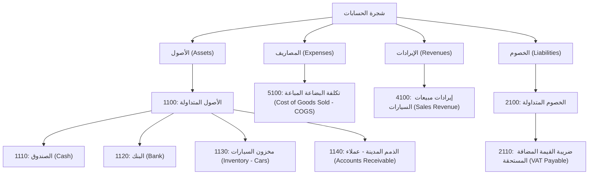

## أولاً: تفصيل محرك المنطق والقواعد (Logic & Rules Engine)

محرك المنطق هو **"العقل"** لنظام `dynacc.ai`. إنه الجزء الذي يحول المدخلات البسيطة التي يقوم بها المستخدم (مثل بيع سيارة بسعر معين) إلى قيود محاسبية دقيقة ومعقدة. بدلاً من أن يكون القيد ثابتاً (دائماً من حساب X إلى حساب Y)، يقوم المحرك بتنفيذ مجموعة من التعليمات والقواعد التي تحددها أنت في **مرحلة التكوين**.

لنبسط الفكرة: تخيل أن كل حركة تجارية هي **وصفة طبخ**.

- **المدخلات (Inputs):** هي المكونات التي يضيفها المستخدم (مثل: كمية، سعر، اسم عميل).
- **محرك المنطق (Logic Engine):** هو خطوات الوصفة (اخلط المكونات، أضف البهارات بنسبة معينة، اطهها لمدة محددة).
- **المخرجات (Output):** هو الطبق النهائي، وهو هنا **القيد المحاسبي الصحيح**.

### سيناريو في مرحلة التكوين (دور فريق dynacc.ai)

**الهدف:** تكوين حركة "فاتورة بيع سيارة" لشركة سيارات.

1.  **تحديد المدخلات:** يحدد فريقنا الحقول التي سيراها موظف المبيعات في الشركة:

    - `customer_name` (اسم العميل)
    - `car_model` (موديل السيارة)
    - `sale_price` (سعر البيع)
    - `discount_percentage` (نسبة الخصم إن وجدت)

2.  **كتابة المنطق (القواعد):** يقوم فريقنا بكتابة المنطق الذي سيعمل خلف الكواليس. يمكن أن يكون هذا المنطق على شكل خطوات بسيطة:

    ```
    // 1. حسابات داخلية
    cost_of_car = GET_COST(car_model) // جلب تكلفة السيارة من حساب المخزون
    vat_rate = 0.16 // تحديد نسبة الضريبة (16%)

    // 2. الحسابات الرئيسية
    price_after_discount = sale_price - (sale_price * discount_percentage)
    vat_amount = price_after_discount * vat_rate
    total_due = price_after_discount + vat_amount

    // 3. توجيه القيد المحاسبي
    DEBIT(Accounts_Receivable, total_due) // مدين: حساب الذمم المدينة بالمبلغ الإجمالي
    CREDIT(Sales_Revenue, price_after_discount) // دائن: حساب إيراد المبيعات بسعر البيع بعد الخصم
    CREDIT(VAT_Payable, vat_amount) // دائن: حساب ضريبة القيمة المضافة المستحقة
    DEBIT(Cost_of_Goods_Sold, cost_of_car) // مدين: حساب تكلفة البضاعة المباعة بتكلفة السيارة
    CREDIT(Inventory_Cars, cost_of_car) // دائن: حساب مخزون السيارات لإخراج السيارة منه
    ```

### سيناريو في مرحلة الاستخدام (دور محاسب شركة السيارات)

**الهدف:** تسجيل عملية بيع سيارة واحدة.

المحاسب يفتح شاشة "إصدار فاتورة بيع سيارة" ويرى فقط الحقول البسيطة:

- **اسم العميل:** شركة الأمل التجارية
- **موديل السيارة:** Toyota Camry 2025
- **سعر البيع:** 100,000
- **نسبة الخصم:** 0

عندما يضغط على "حفظ"، يقوم **محرك المنطق** بتنفيذ جميع الخطوات المعقدة في الخلفية فوراً، ويقوم بإنشاء القيد المحاسبي الخماسي (من 5 أطراف) بشكل آلي ودقيق دون أي تدخل من المحاسب. هذا هو جوهر قوة النظام.

---

## ثانياً: مثال عملي - نظام محاسبة لشركة بيع سيارات

لنبني نظاماً لهذه الشركة خطوة بخطوة.

### الخطوة 1: مرحلة التكوين (بواسطة فريق dynacc.ai)

#### أ. تصميم شجرة الحسابات (Chart of Accounts)

سنقوم بإنشاء الحسابات الأساسية التي تحتاجها الشركة:



#### ب. تعريف الحركات ومنطقها (Transactions & Logic)

**1. حركة بسيطة (حسابان فقط): "سند قبض من عميل"**

- **الاسم:** `Customer Payment Receipt`
- **المدخلات:**
  - `customer_name` (اسم العميل)
  - `amount_received` (المبلغ المستلم)
  - `payment_method` (طريقة الدفع: نقداً/بنك)
- **محرك المنطق:**

  ```
  // 1. تحديد حساب الدفع
  IF payment_method == "Cash" THEN
      debit_account = 1110 // الصندوق
  ELSE
      debit_account = 1120 // البنك
  END IF

  // 2. توجيه القيد
  DEBIT(debit_account, amount_received)
  CREDIT(Accounts_Receivable, amount_received) // حساب الذمم المدينة
  ```

**2. حركة معقدة (أكثر من حسابين): "فاتورة بيع سيارة بالآجل"**

- **الاسم:** `Credit Car Sale Invoice`
- **المدخلات:**
  - `customer_name` (اسم العميل)
  - `car_model` (موديل السيارة الذي سيتم ربطه بالمخزون)
  - `sale_price` (سعر البيع)
- **محرك المنطق:** (نفس المنطق المذكور في السيناريو الأول)

  ```
  cost_of_car = GET_COST(car_model)
  vat_rate = 0.16
  vat_amount = sale_price * vat_rate
  total_due = sale_price + vat_amount

  DEBIT(Accounts_Receivable, total_due)
  CREDIT(Sales_Revenue, sale_price)
  CREDIT(VAT_Payable, vat_amount)
  DEBIT(Cost_of_Goods_Sold, cost_of_car)
  CREDIT(Inventory_Cars, cost_of_car)
  ```

### الخطوة 2: مرحلة الاستخدام (أمثلة عملية لموظف الشركة)

#### مثال 1: بيع سيارة Toyota Camry بالآجل (تكلفة 80,000 وسعر البيع 100,000)

القيود الفرعية التفصيلية الناتجة عن الفاتورة:

| قيد | المدين | الدائن | المبلغ | الوصف |
|-----|--------|--------|--------|-------|
| 1 | الذمم المدينة – عملاء | إيرادات مبيعات السيارات | 100,000 | بيع السيارة للعميل |
| 2 | الذمم المدينة – عملاء | ضريبة القيمة المضافة | 16,000 | ضريبة مستحقة عن البيع |
| 3 | إيرادات المبيعات | الذمم المدينة – عملاء | 100,000 | مقابلة المدين |
| 4 | ضريبة القيمة المضافة | الذمم المدينة – عملاء | 16,000 | مقابلة المدين |
| 5 | تكلفة البضاعة المباعة | مخزون السيارات | 80,000 | خصم المخزون |
| 6 | مخزون السيارات | تكلفة البضاعة المباعة | 80,000 | مقابلة المدين |

#### مثال 2: استلام دفعة العميل 50,000

| قيد | المدين | الدائن | المبلغ | الوصف |
|-----|--------|--------|--------|-------|
| 7 | البنك | الذمم المدينة – عملاء | 50,000 | استلام دفعة من العميل |
| 8 | الذمم المدينة – عملاء | البنك | 50,000 | مقابلة المدين |

بهذا الأسلوب، يمكن استكمال القيود لتصل إلى 10 قيود إذا أردنا تفصيل كل جزء صغير من العملية أو تقسيم الحسابات الداخلية الأخرى.

---

## ثالثاً: تصور الواجهات (UI Mockups)

استخدام Mermaid لتصميم واجهات معقدة قد يكون غير عملي. بدلاً من ذلك، سأقوم بتصميمها كنص منظم يوضح شكل الشاشة ومكوناتها.

### 1\. شاشة محرر المنطق (لـ فريق dynacc.ai)

<div style="border: 1px solid black; padding: 10px; width: 600px; font-family: Arial, sans-serif;">
<h3>شاشة تكوين حركة تجارية جديدة</h3>
<label>اسم الحركة:</label> <input type="text" value="فاتورة بيع سيارة بالآجل" style="width: 300px;"><br><br>
<h4>مدخلات المستخدم (Inputs)</h4>
<button>+ إضافة حقل</button><br>
1. اسم الحقل: <input type="text" value="customer_name"> نوع البيانات: <input type="text" value="نص"><br>
2. اسم الحقل: <input type="text" value="car_model"> نوع البيانات: <input type="text" value="قائمة من المخزون"><br>
3. اسم الحقل: <input type="text" value="sale_price"> نوع البيانات: <input type="text" value="رقم عشري"><br><br>
<h4>محرك المنطق والقواعد (Logic)</h4>
<textarea rows="4" cols="50">
cost_of_car = GET_COST(car_model)
vat_amount = sale_price * 0.16
total_due = sale_price + vat_amount
...
</textarea><br><br>
<h4>هيكل القيد المحاسبي (Output)</h4>
<table border="1" style="width: 100%;">
<tr><th>الطرف</th><th>الحساب</th><th>القيمة</th></tr>
<tr><td>مدين</td><td>الذمم المدينة</td><td>total_due</td></tr>
<tr><td>دائن</td><td>إيرادات المبيعات</td><td>sale_price</td></tr>
<tr><td>دائن</td><td>ضريبة مستحقة</td><td>vat_amount</td></tr>
<tr><td>مدين</td><td>تكلفة البضاعة</td><td>cost_of_car</td></tr>
<tr><td>دائن</td><td>المخزون</td><td>cost_of_car</td></tr>
</table><br>
<button>حفظ التكوين</button>
</div>

### 2\. شاشة إدخال الفاتورة (لـ عميل شركة السيارات)

<div style="border: 1px solid black; padding: 10px; width: 600px; font-family: Arial, sans-serif;">
<h3>فاتورة بيع سيارة جديدة</h3>
<div style="text-align: right;">التاريخ: <input type="text" value="14-09-2025"></div><br>
<label>اسم العميل:</label> <input type="text" value="شركة الأمل" style="width: 200px;"> (بحث)<br><br>
<label>موديل السيارة:</label> <input type="text" value="Toyota Camry 2025" style="width: 200px;"> (قائمة)<br><br>
<label>سعر البيع:</label> <input type="text" value="100,000" style="width: 200px;"><br><br>
<p>-- النظام سيقوم بحساب الضريبة وتوليد القيد تلقائياً --</p><br>
<button>حفظ الفاتورة</button>
</div>

---

## رابعاً: وصف الشاشات والواجهات (UI Screens Description)

<div style="font-family: Arial, sans-serif; direction: rtl; text-align: right;">
<h3>الميزات الرئيسية للواجهات:</h3>

<h4>إدخال القيود والسندات:</h4>
<ul>
<li>واجهة بسيطة لإدخال الحركات التجارية التي تم تكوينها مسبقًا.</li>
<li>تعبئة الحقول المطلوبة (مثل: اسم العميل، المبلغ، الكمية، التاريخ).</li>
<li>يقوم النظام تلقائيًا بتوليد القيد المحاسبي بناءً على المنطق المحدد مسبقًا.</li>
</ul>

<h4>التقارير المالية:</h4>
<ul>
<li>عرض التقارير التي تم تكوينها (كشف حساب، ميزان المراجعة، قائمة الدخل، الميزانية العمومية).</li>
<li>إمكانية فلترة التقارير حسب التاريخ أو الحساب.</li>
</ul>

<h4>إدارة المستخدمين والصلاحيات:</h4>
<ul>
<li>إنشاء مستخدمين جدد داخل الشركة.</li>
<li>تحديد صلاحيات كل مستخدم (عرض، إضافة، تعديل، حذف، موافقة على السندات).</li>
</ul>

<h4>إدارة الفروع (اختياري):</h4>
<ul>
<li>القدرة على تعريف فروع متعددة للشركة وفصل بياناتها وتقاريرها.</li>
</ul>

<h3>6. وصف الشاشات (UI Screens)</h3>

<h4>شاشة فريق dynacc.ai (واجهة التكوين)</h4>

<h5>شاشة إدارة الحسابات:</h5>
<ul>
<li>عرض شجري للحسابات.</li>
<li>أزرار "إضافة حساب جديد"، "تعديل"، "حذف".</li>
<li>نموذج (Form) لإدخال بيانات الحساب (الاسم، الكود، النوع، الحساب الأب).</li>
</ul>

<h5>شاشة إدارة الحركات التجارية:</h5>
<ul>
<li>قائمة بجميع أنواع الحركات المعرفة.</li>
<li>نموذج لإنشاء حركة جديدة وتحديد اسمها والحسابات الافتراضية (المدين والدائن).</li>
<li>قسم "محرر المنطق" وهو مساحة نصية أو واجهة رسومية بسيطة لكتابة القواعد الحسابية الخاصة بالحركة.</li>
</ul>

<h4>شاشة العميل (واجهة الاستخدام)</h4>

<h5>لوحة المعلومات الرئيسية (Dashboard):</h5>
<ul>
<li>رسوم بيانية لأهم المؤشرات (مثل: الإيرادات، المصاريف، صافي الربح).</li>
<li>اختصارات للحركات الأكثر استخدامًا.</li>
<li>جدول بآخر السندات التي تم إدخالها.</li>
</ul>

<h5>شاشة إدخال حركة جديدة:</h5>
<ul>
<li>قائمة منسدلة لاختيار نوع الحركة (التي تم تعريفها في مرحلة التكوين).</li>
<li>حقول ديناميكية تظهر بناءً على نوع الحركة المختار (مثل: حقل "الكمية" و "سعر الوحدة" في فاتورة البيع).</li>
<li>زر "حفظ" لتوليد السند والقيد المحاسبي.</li>
</ul>

<h5>شاشة التقارير:</h5>
<ul>
<li>قائمة بالتقارير المتاحة.</li>
<li>فلاتر لتحديد النطاق الزمني (من تاريخ إلى تاريخ) أو حساب معين.</li>
<li>عرض التقرير في جدول مع خيارات للطباعة أو التصدير (PDF, Excel).</li>
</ul>

<h5>شاشة إدارة المستخدمين والصلاحيات:</h5>
<ul>
<li>جدول بالمستخدمين الحاليين.</li>
<li>نموذج لإضافة مستخدم جديد وتعيين دوره (مدير، محاسب، مدخل بيانات).</li>
<li>مصفوفة صلاحيات لتحديد ما يمكن لكل دور أن يفعله.</li>
</ul>
</div>
